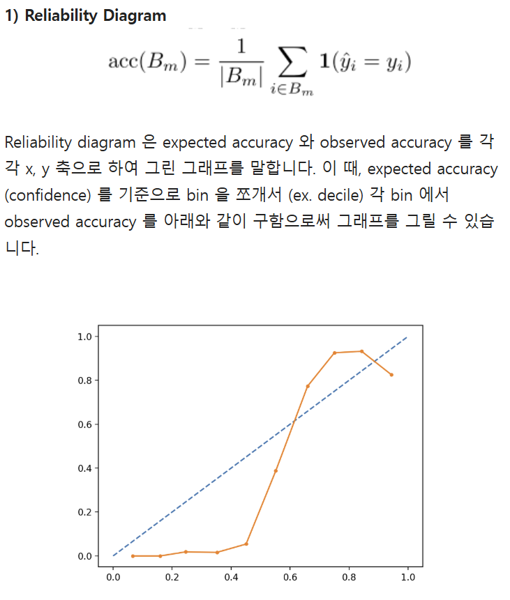

# 5.2 다음 실험 방향 설계

멘션: 이정한
사람: 이현지
상위 항목: [v0.1.1] 수정데이터 학습 (https://www.notion.so/v0-1-1-35313fe1788780d8b81de5f9d967c41c?pvs=21)
생성 일시: 2026년 5월 2일 오후 8:08
진행도: 완료
타입: 실험 설계

## 1. 현재 상황 요약

**✅ 확정 사항**

| 항목 | 결정 | 근거 |
| --- | --- | --- |
| 데이터 | processed_v3 (정제 완료) | H6 ~ H24 x 4 실험 설정, 결측률 0%, 중복·비상장 데이터 제거 완료 |
| 섹터 정보 | 미사용 (제외 확정)
 | KSIC→GICS 매핑 한계 + 섹터별 양성 샘플 부족으로 제외 |

**⚠️ 재검증 필요 — 4.27 보고서는 구버전 데이터(processed_v1) 기준**   

| **항목** | **현재 값** | **재검증 방향** |
| --- | --- | --- |
| 최적 모델 | RF (H12, PR-AUC 0.2035) | processed_v3으로 재실험 필요 |
| 불균형 전략 | 없음 + Threshold 최적화 | 전략 자체는 유효하나 수치 재확인 필요 |
| 평가 지표 | PR-AUC (Primary) | 지표 선정 근거는 유효, 수치만 재측정 |

processed_v3으로 재실험 후 갱신만 하면 됨.

## 2. 전체 실험 로드맵

| # | 우선순위 | 실험 항목 | 목적 / 기대 효과 | 선행 조건 |
| --- | --- | --- | --- | --- |
| 1 | 🔴 즉시 | processed_v3 기준 RF 전 Horizon 재실행 | H6~H24 baseline 재확립 / H6·H8 참고용 명시 | - |
| 2 | 🔴 즉시 | Optuna 하이퍼파라미터 튜닝 | H12 primary, XGB·LGBM RF 추월 가능성 검증 | 실험 1 완료 |
| 3 | 🟡 이후 | 전처리 옵션 비교 (exp-A/B/C) | Winsorize·RobustScaler 성능 영향 확인 | 실험 1 완료 |
| 4 | 🟡 이후 | Threshold 전략 고도화 | F1 → F2 전환, Recall 목표 기반 다중 threshold | 실험 2 완료 |
| 5 | 🟡 이후 | YoY 증가율 3종 포함 실험 | 결측률 68%→14% 개선, 성장성 피처 추가 효과 검증 | 실험 2 완료 |
| 6 | 🟢 후반 | 앙상블 (Blending) | 상위 2개 모델 가중평균 결합 | 실험 2 완료, 2위 모델 PR-AUC ≥ 1위의 80% |
| 7 | 🟢 후반 | 확률 보정 (Calibration) | Platt scaling, RiskScore = 100 × P_calibrated | 실험 2·6 중 best 모델 확정 후 |
| 8 | 🟢 후반 | SHAP 기반 설명가능성 | 기업별 위험 기여 변수 Top-5 추출 | 실험 7 완료 |

## 3. 실험 SET

| 실험 | 변경 축 | 고정 조건 | 비교 기준 |
| --- | --- | --- | --- |
| 1 | **데이터 버전** (v1→v3) | RF, baseline 전처리, H12 | 이전 수치 대비 PR-AUC 변화 |
| 2 | **H (Horizon)** H6~H24 | RF, baseline 전처리 | H별 PR-AUC, 양성 수, 안정성 |
| 3 | **모델** RF / XGB / LGBM / GBM | H12, baseline 전처리, Optuna 튜닝 | valid PR-AUC 기준 모델 선정 |
| 4 | **전처리** baseline / exp-A / exp-B / exp-C | RF, H12 | baseline 대비 PR-AUC 변화량 |
| 5 | **Threshold** F1 / F2 / Recall 고정 | best 모델, H12 | Recall·Precision 변화 |
| 6 | **피처셋** 32개 vs 35개 (YoY 추가) | best 모델, baseline 전처리, H12 | PR-AUC 차이 |
| 7 | **앙상블** 단일 vs 블렌딩 | Optuna 튜닝 완료 상위 2개 | PR-AUC 개선 여부 |
| 8 | **Calibration** 보정 전 vs Platt | best 모델, H12 | ECE, Reliability Diagram |

## 4. 실험별 상세 설계

**데이터 구조 배경**

현재 데이터셋은 기업 단위가 아닌 (기업, 기준시점 T) 단위 샘플 구조로 구성돼 있다. 각 기업에 대해 분기별로 기준시점 T를 이동시키며 샘플을 생성하므로, 동일 기업이 여러 T에 걸쳐 반복 등장한다. H는 “T이후 H개월 내 상폐 발생 여부”를 라벨로 정의하는 예측 기간이며, H가 길수록 더 많은 시점에서 양성 라벨을 부여할 수 있어 양성 샘플이 늘어난다.
H6~H24 각 데이터셋은 이 구조에서 H값만 달리해 생성된 것이다.

### 4-1. processed_v3 기준 baseline 재확립

이전 보고서 수치는 구버전 데이터 기반이라 새 baseline을 먼저 확정해야 이후 모든 실험의 비교 기준이 생긴다.

- 대상 모델: Random Forest (이전 best 모델)
- 대상 H: H6 ~ H24 전체 동시 실행
- 전처리 baseline (clipping만)
- 결과 기록: H별 PR-AUC, F1, Threshold 표로 정리

Horizon별 활용 가이드:

| **H** | **valid 양성** | **test 양성** | **등급** | **비고** |
| --- | --- | --- | --- | --- |
| H6 | 11개 | 20개 | ⚠️ 참고용 | valid 양성 11개로 threshold 최적화 불안정. 결과 신뢰 어려움 |
| H8 | 15개 | 27개 | ⚠️ 참고용 | valid 양성 15개. H6과 동일 이유로 참고용 취급 |
| H10 | 21개 | 36개 | ✅ 메인 | valid/test 모두 20개 이상. 단기 경고 모델로 활용 |
| H12 | 27개 | 51개 | ✅ 메인 (Primary) | best 성능 구간. PR-AUC 0.2035 확인 |
| H14~H18 | 34~54개 | 54~61개 | ✅ 메인 | 양성 충분, 성능-실용성 균형 구간 |
| H20~H24 | 46~87개 | 27~46개 | ⚠️ 주의 | test 행 급감 (1,307~2,623행) 표본 적어 수치 변동 가능성 높음. → 이 구간 수치는 진짜 성능인지 판단하기 어려움. |

⚠️ **기업 암기 리스크 (부분 완화)**

현재 데이터 분할은 시간 기준(Time split)만 적용돼 있다. train/test 기업 중복률이 88~100%로 확인됐으며, 모델이 특정 기업의 재무 패턴을 암기할 가능성이 있다.
기업 완전 분리(Group holdout)는 H12 기준 test 양성이 7~12개 수준으로 줄어 데이터 부족으로 통계적 평가가 불가능해지므로 적용하지 않는다.

대신 Optuna 튜닝 시 train 내부 CV에서 GroupKFold를 적용해 하이퍼파라미터 탐색 단계의 기업 암기를 부분적으로 방지한다. 최종 test 평가는 time split 기준을 유지하며, 이 한계는 결과 보고 시 명시한다.

**→ 산출물: H별 PR-AUC·F1·Threshold 비교 표, Horizon 활용 등급 문서**

### 4-2. Optuna 하이퍼파라미터 튜닝

현재 각 모델은 baseline 상태. XGBoost나 LightBGM은 튜닝 여부에 따라 성능 변화가 크며, 특히 early stopping 설정과 eval_metric 선택에 민감하다.

튜닝 설정:

| **모델** | **탐색 파라미터** | **비고** |
| --- | --- | --- |
| Random Forest | n_estimators, max_depth, max_features, min_samples_leaf | n_estimators를 높이다보면 수렴하는 지점 발생.
→ 더 많은 트리가 성능 향상에 도움 됨. 수렴 이후엔 계산 비용만 증가 |
| XGBoost | learning_rate, max_depth, subsample, colsample_bytree, reg_alpha | eval_metric=aucpr 고정, early_stopping=50 |
| LightGBM | learning_rate, num_leaves, min_child_samples, feature_fraction | valid 양성 적어 early stopping 불안정 → rounds 여유 |
| GBM | learning_rate, max_depth, subsample, n_estimators | baseline 대비 개선 여부 확인용 |
- 1순위 H: H12 (best 성능 구간)
- 2순위 H: H10 (단기 경고 모델)
- trial 수: 모델 당 50~100회 권장 (trial 1회 = GroupKFold 5회 학습, 총 250~500회 학습)

단계별 평가 방식:

| 단계 | 평가 방식 | 목적 |
| --- | --- | --- |
| Optuna 튜닝 | train 내부 GroupKFold(5-fold) CV 평균 PR-AUC | 파라미터 선정 |
| 최종 모델 선정 | fixed valid set (2020년) PR-AUC | 모델 간 비교 |
| 최종 성능 보고 | test set (2021년) PR-AUC | 보고용 (단 한 번만 사용) |

Optuna 튜닝은 train 데이터만 사용하며, valid set은 이 과정에서 완전히 격리한다. 튜닝 중에 valid를 반복해서 보면 그 점수에 맞게 파라미터가 과적합될 수 있기 때문이다.

구체적인 흐름은 다음과 같다:

1. Optuna가 trial마다 파라미터 조합을 제안하면, train을 GroupKFold로 5분할해 fold 평균 PR-AUC를 계산하고 Optuna에 반환한다.
2. 100회 trial이 끝나면 가장 높은 fold 평균 PR-AUC를 기록한 파라미터 조합을 최적 파라미터로 확정한다.
3. 확정된 파라미터로 train 전체를 다시 학습한다.
4. 모든 모델의 튜닝이 끝난 뒤, 처음으로 fixed valid set에 넣어 모델 간 PR-AUC를 비교하고 best 모델을 선정한다.
- GroupKFold groups 기준: `stock_code` (기업 단위). 하나의 기업은 오직 하나의 fold에만 포함.

※ trial당 GroupKFold 5회 학습으로 단순 K-Fold 대비 실험 시간이 증가함. 시간 제약 시 trial 수를 50회로 줄이거나 n_splits=3으로 조정 가능

*※ XGBoost early_stopping_rounds는 30 → 50으로 여유를 주는 것 권장. valid 양성이 적어 조기 종료 불안정 가능성 있음*

**→ 산출물: 모델별 최적 파라미터 JSON, valid/test PR-AUC 비교 표, GroupKFold CV 점수 로그**

### 4-3. 전처리 옵션 비교

processed_v3에 baseline / exp-A / exp-B / exp-C 4가지 버전이 이미 저장돼 있어 바로 실험 가능.

- exp-A: clipping + Winsorize (수익성 계열 5개 대상)
- exp-B: clipping + RobustScaler
- exp-C: clipping + Winsorize + RobustScaler
- 비교 기준: baseline 대비 PR-AUC 변화량

*※ 수익성 계열(매출액순이익률 등) 왜도가 극단적이라 Winsorize 효과가 클 가능성 있음*

**→ 산출물: exp-A/B/C vs baseline PR-AUC 비교 표, 채택 전처리 설정 확정 문서**

### 4-4. Threshold 전략 고도화

현재는 valid PR curve에서 F1 최대화 단일 threshold만 사용하고 있다. 조기경보 시스템 목적상 F2(Recall 중심) 기반으로 전환이 필요하다.

| **방식** | **방법** | **비고** |
| --- | --- | --- |
| F1 최대화 (현행) | valid PR curve에서 F1 최대 지점 | 재학습 후 기준점 확인 필요. |
| F2 최대화 (추가) | Recall에 2배 가중치 부여 | 조기경보 목적 반영. FN 비용 > FP 비용 가정 |
| Recall 고정 (추가) | Recall 70% / 80% 각각 만족하는 threshold 탐색 | 운영 정책 기반 threshold 제시용 |
- 최종 운영 threshold는 팀 논의 후 결정 (Recall 목표치 합의 필요)

*※ 상폐 기업을 놓치는 비용(FN) > 정상 기업을 경고하는 비용(FP) 가정 반영*

**→ 산출물: F1·F2·Recall 고정 방식별 threshold 및 Precision·Recall 비교 표, 운영 threshold 후보 목록**

### 4-5. YoY 증가율 3종 포함 실험

이전 실험에서 결측률 66%로 제외했던 매출액증가율·순이익증가율·영업이익증가율이 processed_v3 기준 결측률 14%로 개선됐다. 해당 3종을 추가했을 때의 성능 변화를 확인하기 위해, 피처셋만 다르고 나머지 조건(모델, 전처리, H)은 동일하게 유지한 A/B 비교 실험을 진행한다.

- 실험 A: 현행 피처 32개 (증가율 3종 제외)
- 실험 B: 다중공선성 후보 3종 제거 + YoY 증가율 3종 추가 → 피처 32개
- 실험 C: 다중공선성 제거만 → 29개 (제거 효과만 단독 확인용)
- 비교: H12 기준 PR-AUC 차이 확인

**→ 산출물: 피처셋 32개 vs 35개 PR-AUC 비교 표, YoY 3종 포함 여부 결정 근거**

### 4-6. 앙상블 (Blending / Stacking)

앙상블은 개별 모델들이 서로 다른 종류의 오류를 만들 때 효과적이며, Bagging은 분산을 줄이고 Boosting은 편향을 줄이는 방향으로 작동해 두 계열을 결합할 때 상호보완 가능성이 있다. 우리도 RF(Bagging)와 부스팅 계열 모델(XGBoost·LightGBM·GBM)은 오류 패턴이 달라 결합 시 효과를 기대할 수 있다.

단, 앙상블은 모델 간 성능 차이가 작을수록 효과적이다. 현재 RF가 PR-AUC 기준으로 부스팅 계열 모델 대비 약 2배 앞서고 있어, 이 상태에서 블렌딩을 하면 약한 모델이 강한 모델을 끌어내릴 수 있다. 따라서 Optuna 튜닝 후 성능 격차가 충분히 좁혀진 경우에 한해 진행한다.

- 조건: 튜닝 후 2위 모델의 PR-AUC가 1위 대비 80% 이상인 경우 진행
- 조합 대상: Optuna 튜닝 결과 기준 상위 2개 모델 (미리 고정하지 않음)
- 방식: 예측 확률 가중평균 (valid PR-AUC 비례 가중치)
- Stacking은 meta-learner 학습을 위한 데이터가 추가로 필요하고 양성 샘플이 적은 현재 상황에서 과적합 위험이 있어 후순위로 검토

**→ 산출물: 단일 모델 vs 블렌딩 PR-AUC 비교 표, 앙상블 진행 여부 결정 근거 (조건 충족 여부 명시)**

### 4-7. 확률 보정 (Calibration)

모델 출력 확률을 RiskScore로 변환하기 전에 보정을 적용한다. 보정이란 모델 출력값이 실제 확률을 반영하도록 만드는 것으로, 예를 들어 모델이 0.8을 출력했을 때 실제로 80% 확률로 상폐 위험이 있다는 의미를 갖도록 만드는 과정이다. RiskScore를 실제 의사결정에 활용하려면 이 신뢰도가 확보되어야 한다.

Calibration 필요성은 best 모델 종류에 따라 달라진다. RF는 여러 트리의 투표 구조 덕분에 이미 확률 추정이 비교적 잘 보정된 모델에 속해 효과가 제한적일 수 있다. 반면 XGBoost·LightGBM 같은 부스팅 계열은 오류에 순차적으로 수정하는 특성상 확신이 높은 샘플에 극단적인 점수를 부여하는 경향이 있어 miscalibrated 확률을 출력하는 경우가 많다. Optuna 튜닝 후 부스팅 계열이 best 모델로 확정될 경우 이 단계의 중요성이 높아진다. 보정 방법으로는 Platt scaling을 사용한다.

적용 후 아래 지표로 보정 전후를 반드시 비교한다.

- Reliability Diagram: 예측 확률 구간(x축)과 실제 정답 비율(y축)을 비교. 대각선에 가까울수록 잘 보정된 것.
    
    
    
- ECE (Expected Calibration Error): bin별 예측 확률과 실제 정확도 차이의 가중 평균. 수치가 낮을수록 좋음.
    
    
    

보정 전후 ECE와 Reliability Diagram을 비교해 개선이 확인된 경우에만 보정 결과를 채택한다

- 최종 출력: RiskScore = 100 × P_calibrated

**→ 산출물: 보정 전후 ECE 수치 비교, Reliability Diagram (보정 전/후 각 1장), 채택 여부 결정 근거**

### 4-8. SHAP 기반 설명가능성

최종 모델 확정 후 각 기업별 위험 기여 변수를 추출한다. 설계안 6-3절 조사 우선순위 로직과 연결된다.

- 기업별 SHAP Top-5 변수 추출
- 전체 feature importance 시각화 (bar chart)
- 위험 점수 상위 기업 SHAP 분석 → 리포트 샘플 작성

*※ 유보액/납입자본비율이 H10·H12 전체 1위로 자본잠식의 직접 지표로 해석 가능*

**→ 산출물: 전체 feature importance bar chart, 위험 점수 상위 기업 SHAP 분석 리포트 샘플 (기업 1개)**

### 4-9. 섹터 정보 미사용 결정 및 근거

설계안 7절에서는 섹터 군집화 및 듀얼트랙 구조를 확장 실험으로 제시했으나, 이번 실험 범위에서는 섹터 정보를 미사용으로 확정했다. 

1. 데이터 부족
    
    H12 train 양성 250개를 11개 섹터로 분할하면 섹터 평균 22개이고, Energy·Real Estate·Utilities는 상폐 기업이 0개다. 섹터별 독립 모델 학습이 불가능한 수준이다.
    
2. KSIC → GICS 매핑 한계
    
    KSIC는 생산 활동 기준, GICS는 매출 기준으로 분류 철학이 달라 1 대 1 변환 정확도가 보장되지 않는다. 실제로 GICS 매핑 기준 변경 후 Consumer Staples 89 → 1,087, Financials 75 → 678로 대규모 재분류가 발생했다.