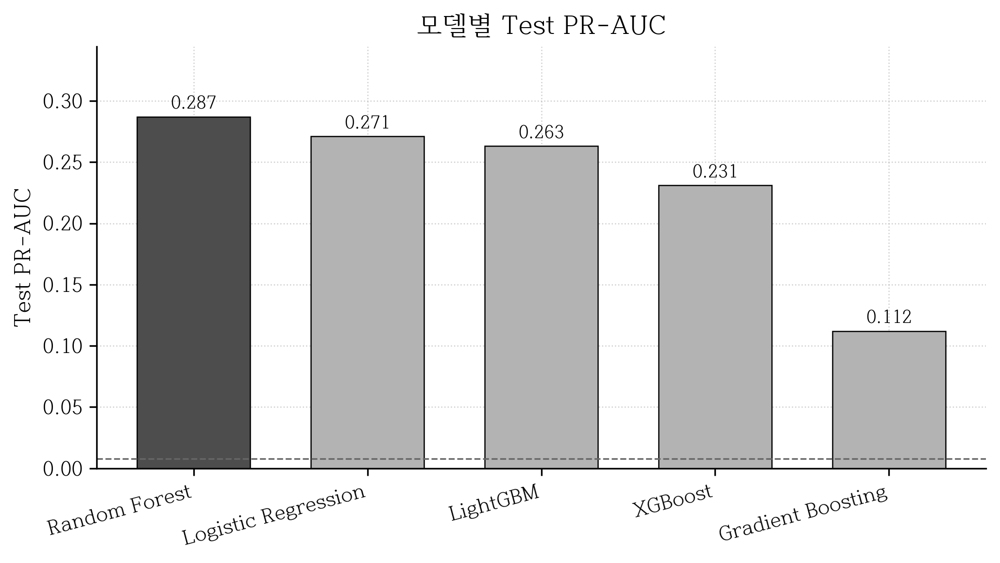
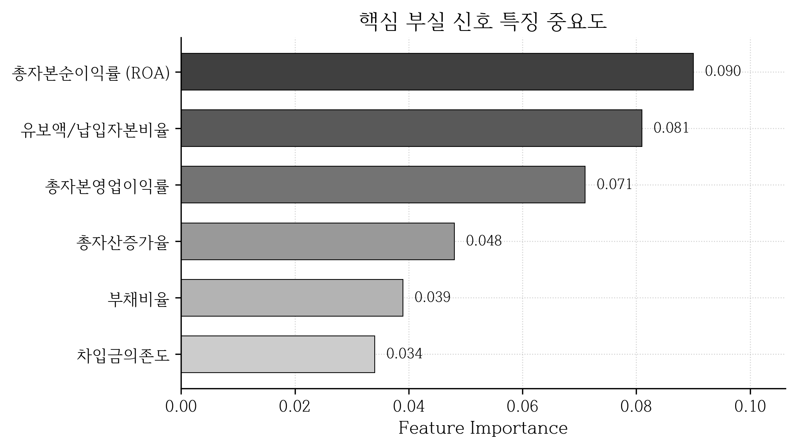

# 캡스톤디자인 최종보고서

## 재무비율 기반 코스닥 기업 상장폐지 위험 예측 모델 개발

| 항목 | 내용 |
|------|------|
| 팀명 | KW0SS |
| 프로젝트명 | 재무비율 기반 코스닥 기업 상장폐지 위험 예측 모델 개발 |
| 수행 기간 | 2026년 2월 ~ 2026년 10월 |
| 소속 | 광운대학교 컴퓨터정보공학부 |

> 본 보고서는 캡스톤디자인 최종발표(`캡스톤_최종발표`) 기준 시점까지 팀이 공동으로 완성한 결과물을 정리한 것이다. 프로젝트 추진 일정(2026.02~10) 상 일부 단계(섹터 군집화 등)는 데이터 제약으로 후순위로 조정되었으므로, 현재까지 완성된 결과물과 향후 과제를 구분하여 서술한다.

---

## 목 차

1. 프로젝트의 개요
   - 가. 배경 및 필요성
   - 나. 목표
   - 다. 개발 내용
2. 프로젝트의 내용
   - 가. 설계 및 개발의 내용 (AI의 활용 포함)
   - 나. 역할 분담
   - 다. 프로젝트 결과물 (AI의 활용 결과 포함)
3. 프로젝트의 활용 및 기여
   - 가. 결과물의 활용
   - 나. 결과물의 기여
4. 프로젝트의 향후 계획
5. 참고문헌

---

# 1. 프로젝트의 개요

## 1.1. 배경 및 필요성

최근 세계 경제는 코로나19 당시의 저금리 기조에서 벗어나 인플레이션 억제를 위한 급격한 금리 인상 시대로 접어들었다. '빅스텝'과 '자이언트 스텝'의 단행은 세계 경기를 급격히 냉각시켰으며, 특히 저금리 환경에서 과도한 부채를 차입해 연명하던 기업들에게 치명적인 재무적 위기를 가져왔다. 경영 위기에 몰린 기업들은 경영권 변동이나 무리한 자금 조달, 시세 조종과 같은 불공정 거래의 유혹에 빠지기 쉬우며, 이는 결국 주가 급락과 거래 정지, 나아가 상장폐지로 이어져 시장에 큰 혼란을 야기한다.

특히 국내 주식시장에서 상장폐지는 투자자에게 회복 불가능한 손실을 입히는 가장 치명적인 사건이다. 그러나 정보력과 분석 능력이 뛰어난 기관 및 외국인 투자자와 달리, 대다수의 개인투자자는 상대적으로 정보 접근성이 떨어져 리스크를 고스란히 떠안는 경우가 빈번하다. 또한 기존의 선행 연구들이 시장 규모가 큰 코스피 시장이나 특정 한계기업만을 대상으로 하는 경우가 많아, 코스닥을 포함한 시장 전체의 위험을 포괄적으로 관리하기에는 한계가 있다.

따라서 복잡한 재무제표와 기업 공시, 거시경제 지표를 결합하여 개인투자자들도 직관적으로 위험을 감지할 수 있는 신뢰도 높은 예측 모형이 필요하다. 이는 단순한 수익 추구를 넘어, 투자자가 감수해야 하는 불필요한 위험을 최소화하고 시장의 공정성을 회복하는 데 직접 기여할 수 있다.

## 1.2. 목표

본 프로젝트의 핵심 목표는 투자자들이 감수해야 하는 불필요한 위험을 최소화하고 장기적인 투자 성과를 보호하는 데 있다. 이를 위해 본 연구는 상장폐지가 집중적으로 발생하는 **코스닥 상장사**를 대상으로 재무제표 데이터, 기업 공시 정보, 거시경제 지표를 결합하는 것을 목표로 상장폐지 예측 모델을 구축한다.

한편 본 연구는 상장폐지 "위험"을 **두 관점**에서 다룬다. 하나는 "어떤 기업이 전반적으로 부실 체질인가"를 판별하는 **장기 위험 진단**이고, 다른 하나는 "특정 시점으로부터 1년 이내에 실제로 상장폐지될 위험이 있는가"를 선제 탐지하는 **단기 조기경보**다. 두 관점은 양성 비율(데이터 불균형 정도)과 목적이 다르므로, 각각에 맞는 별도 프로토타입으로 탐색하고 절대 성능 수치를 직접 비교하지 않는다.

구체적인 목표는 다음과 같다.

- 전통적인 머신러닝 모델을 중심으로 다양한 알고리즘을 비교·확장하여 상장폐지에 실질적인 영향을 미치는 **핵심 재무 요인을 규명**한다.
- 접근성이 낮고 복잡한 재무제표 데이터를 분석하여 투자자에게 단순 참고 자료 이상의 **'경각심을 주는 핵심 도구'** 를 제공한다.
- 감각이나 추측에 의존하는 투자를 방지하고, 기업의 재무 상태와 경영 성과를 객관적으로 보여주는 데이터에 기반한 **투명한 투자 판단 지원 시스템**을 실현한다.

## 1.3. 개발 내용

본 프로젝트는 상장폐지 예측을 위해 데이터 수집부터 최종 판단까지의 전 과정을 자동화·정형화된 파이프라인으로 구성하며, 다음 5단계로 이루어진다.

1. **데이터 수집** — KIND·DART·KRX·거시지표 자동 수집
2. **데이터 전처리 및 특징 추출** — 재무비율 산출, 시간 기준 라벨링, 결측·이상치 처리
3. **섹터 군집화** — 재무 구조가 유사한 산업군 묶기 *(데이터 제약으로 후순위)*
4. **예측 모델링 및 앙상블** — 전체 시장 모델 중심, 트리 모델 결합
5. **모델 예측 결합 및 최종 판단** — 보수적 threshold 기반 위험 종목 선정

최종발표 기준 시점까지 **① 데이터 수집, ② 전처리·특징 추출, ④ 예측 모델링(트리 기반 전체 시장 모델 및 실험 인프라)**이 완성되었다. 다만 **③ 섹터 군집화는 군집별 학습에 필요한 양성 표본이 절대적으로 부족하여(전체 양성 378개) 현실성이 낮다고 판단해 후순위로 두었으며**, 이에 따라 ⑤의 군집 기반 교집합 앙상블도 모델 수준 앙상블(트리 모델 결합)로 대체하여 향후 검토한다. 또한 **기업 공시 정보(감사의견·관리종목 이력)의 결합은 ② 단계의 확장 과제로 향후 추진**한다. 본 보고서의 "결과물"은 현재까지 완성된 ①②④를 중심으로 기술한다.

---

# 2. 프로젝트의 내용

## 가. 설계 및 개발의 내용

### 1) 개념 설계 (구조 설계)

전체 시스템은 원천 데이터에서 출발해 위험 종목 리포트까지 이어지는 단방향 파이프라인으로 설계되었다. 각 단계의 진행 상태를 **✓(완료) / ◐(진행 중)** 로 표기한다.

```
┌──────────────────────────────────────────────────────────────┐
│  데이터 소스                                                   │
│  • DART OpenAPI (분기·반기·사업보고서 재무제표)               │
│  • KIND (한국거래소 기업공시채널: 상장기업 목록)              │
│  • KRX 상장법인목록(상장일) · 거시경제 지표(VIX/GDP/환율/CPI)  │
└───────────────┬──────────────────────────────────────────────┘
                │  [1] 데이터 수집  ✓   (collect_to_raw.py → S3)
                ▼
        ┌───────────────────────────────────┐
        │  raw JSON (원본 계정과목)          │
        │  {healthy|delisted}/{섹터}/        │
        │   {종목코드}_{연도}_{분기}.json     │
        └───────────────┬───────────────────┘
                │  [2] 전처리·특징 추출  ✓
                │   2-1 build_master_dataset.py
                │     • 계정과목 → 표준키 매핑 → 30개 재무비율
                │     • YoY 증가율 / KRX 상장일 필터링
                │   2-2 build_h_datasets.py
                │     • 시간 기준 라벨링 + Time Split
                │     • 결측 보간 · 클리핑 · winsorize/scaling
                ▼
        ┌───────────────────────────────────┐
        │  학습 데이터셋 (33 피처)            │
        │  train 2015–22 / valid 23 / test 24│
        └───────────────┬───────────────────┘
                        │  [3] 예측 모델링  ✓
                        ▼
        ┌───────────────────────────────────┐
        │  전체 시장 모델                     │
        │  • RF / XGBoost / LightGBM /        │
        │    GradientBoosting / LogReg        │
        │  • 불균형 대응 + threshold 튜닝     │
        │  • 평가: PR-AUC·ROC·P@K             │
        └───────────────┬───────────────────┘
                        │  [4] 위험 점수 산출
                        ▼
        ┌───────────────────────────────────┐
        │  위험 종목 리포트·위험 점수         │
        └───────────────────────────────────┘

   ┌╌╌ (후순위) ╌╌╌╌╌╌╌╌╌╌╌╌╌╌╌╌╌╌╌╌╌╌╌╌╌╌╌╌╌╌╌╌╌╌╌╌┐
   ┊ 섹터 군집화(자카드+계층군집) → 군집 모델 →     ┊
   ┊ 교집합 앙상블 — 군집별 양성 표본 부족으로 후순위 ┊
   └╌╌╌╌╌╌╌╌╌╌╌╌╌╌╌╌╌╌╌╌╌╌╌╌╌╌╌╌╌╌╌╌╌╌╌╌╌╌╌╌╌╌╌╌╌╌┘
```

> 데이터 수집·전처리(①②)와 전체 시장 모델의 트리 기반 학습·평가(③)는 완료되었다. 당초 구상했던 섹터 군집화·군집 모델·교집합 앙상블은 군집별 학습에 필요한 양성 표본이 부족하여 후순위로 두었으며, 앙상블은 모델 수준 결합으로 대체해 향후 검토한다.

### 2) 상세 설계 (기능 설계)

#### (1) 데이터 수집 및 자동화 파이프라인

상장폐지 기업과 정상 기업의 재무적 특성을 비교하기 위해, 한국거래소(KRX) 기업공시채널(KIND)에서 시장·산업별 상장 기업 목록을 수집한다. KIND는 공식 API가 없으므로 Python 기반 웹 크롤링으로 기업명·종목코드를 확보한다.

이후 금융감독원의 **Open DART API**를 활용해 각 기업의 분기 재무제표를 자동 수집한다. 보고서 종류는 분기·반기·사업보고서를 모두 포함한다.

| 보고서 | DART reprt_code | 의미 |
|--------|-----------------|------|
| Q1 | 11013 | 1분기보고서 |
| H1 | 11012 | 반기보고서 |
| Q3 | 11014 | 3분기보고서 |
| ANNUAL | 11011 | 사업보고서 |

- 연결재무제표(CFS)를 우선 시도하고, 결과가 비어 있으면 개별재무제표(OFS)로 폴백한다.
- 수집된 원본은 `{healthy|delisted}/{GICS 섹터}/{종목코드}_{연도}_{분기}.json` 규칙으로 저장하며, 동일 규칙으로 **AWS S3**에 업로드해 팀 공용 저장소로 관리한다. (`s3/uploader.py`, `s3/query.py`, `s3/cli.py`)
- GICS 기반 11개 주요 섹터로 매핑하며, 재무 구조가 특이한 산업 및 예외 기업은 분석 대상에서 제외한다.

#### (2) 데이터 전처리 및 특징 추출

전처리는 두 단계로 나뉜다.

**Step 1 — 원본 JSON → 재무비율 (`build_master_dataset.py`)**

- `account_mapper`: 계정과목 명칭을 정규식 패턴으로 표준 키(자산총계, 매출액, 영업이익, 당기순이익 등)에 매핑한다. 기업마다 상이한 계정 표기를 통일하기 위함이다.
- `ratio_calculator`: 표준 키로부터 성장성·수익성·활동성·안정성·가치평가 **30개 재무비율**을 계산한다.
- **YoY 증가율(전년 동기 방식)**: 손익계산서 항목의 분기·반기 보고서 전기값(frmtrm) 결측률이 92% 이상이므로, 전년 동기 대비 방식으로 매출액·순이익·영업이익 증가율을 산출한다.
- **KRX 상장일 필터링**: 종목코드 재사용(상폐 기업의 코드를 신규 기업이 재사용) 문제를 해결하기 위해, 상장일 이전 분기 행을 제거한다.

**Step 2 — 시간 기준 라벨링 및 학습 데이터셋 구성 (`build_h_datasets.py`)**

데이터 오염과 생존 편향을 방지하기 위해 기업 단위가 아닌 **기준 시점(T) 중심의 시간 기준 라벨링**을 적용한다.

- 매 시점 T를 기준으로 이후 실제 상장폐지 발생 여부에 따라 라벨을 정의한다.
- 이미 상장폐지된 기업의 과거 정상 데이터도 학습에 활용한다.
- **Time Split**: train(2015–2022) / valid(2023) / test(2024) 로 연도를 분리해 미래 데이터가 과거 예측에 새어 들어가지 않게 한다.
- 결측 처리: 기업 내 ffill → 감가상각비 등 현금흐름 항목 0 보정 → 섹터·분기 중앙값 보간 → 전체 중앙값 fallback.
- 이상치: 도메인 규칙(예: 부채비율 0~2,000%, 수익성 −500~100%) 기반 클리핑. 추가로 winsorize·RobustScaler를 조합한 전처리 변형(baseline/exp-A/exp-B/exp-C)을 실험한다.

#### (3) 피처 사전 (33개 피처)

재무비율 27개 + 거시경제 6개로 구성된다.

| 범주 | 피처 |
|------|------|
| 성장성(5) | 총자산증가율, 유동자산증가율, 매출액증가율, 순이익증가율, 영업이익증가율 |
| 수익성(3) | 매출액순이익률, 매출총이익률, 자기자본순이익률(ROE) |
| 활동성(5) | 매출채권회전율, 재고자산회전율, 총자본회전율, 유형자산회전율, 매출원가율 |
| 안정성(13) | 부채비율, 유동비율, 자기자본비율, 당좌비율, 비유동자산장기적합률, 순운전자본비율, 차입금의존도, 현금비율, 유형자산, 무형자산, 무형자산상각비, 유형자산상각비, 감가상각비 |
| 가치평가(4) | 총자본영업이익률, 총자본순이익률, 유보액/납입자본비율, 총자본투자효율 |
| 거시경제(6) | credit_spread, kosdaq_return, gdp_growth_yoy, usdkrw_chg, vix_avg, cpi_yoy |

수익성 지표는 상장폐지 기업의 대규모 적자·자본잠식을 반영해 왜도·첨도가 매우 큰 좌편포 분포를 보이므로, 제거 대신 `signed_log1p` 변환과 winsorize로 극단값 영향만 완화한다.

#### (4) 시간 기준 라벨링 패러다임

두 가지 라벨 정의를 비교 설계했다.

- **fixed_N (backward, 상폐 N년 전)**: 상장폐지 연도 기준 N년 전 연도의 모든 분기를 양성으로 정의. 위험 신호가 뚜렷하다.
- **Horizon (forward, 향후 H개월)**: 기준 시점 T로부터 향후 H개월 내 상폐 여부를 양성으로 정의. 운영 시 실시간성이 높다.

상폐 기업이 매우 적어 클래스 불균형이 **약 124:1** 에 달하므로, 정확도(accuracy)가 아닌 **PR-AUC**를 주지표로 삼고 threshold 튜닝을 필수로 적용한다.

#### (5) 섹터 군집화 — 검토 및 후순위 결정

섹터 군집화는 본 프로젝트 제목이 담은 출발 아이디어였다. 산업군마다 부실 양상이 달라(제조업의 높은 부채비율이 IT·바이오에서는 위험 신호) 재무 구조가 유사한 섹터를 **자카드 계수 + 응집형 계층적 군집화**로 묶고 군집별 모델을 학습하면 산업 특화 위험을 더 잘 포착할 수 있다는 가설이었다(김태관 외 2024).

그러나 검토 결과 **현실성이 낮다고 판단해 후순위로 두었다.** 전체 양성이 378개에 불과한 극단적 불균형 환경에서 이를 다시 섹터 군집으로 분할하면 **군집당 양성이 수십 개 이하로 떨어져** 안정적인 학습이 불가능하다. 군집화는 충분한 양성 표본이 확보되는 시점(외부 데이터 결합 등으로 양성이 확장될 경우)에 재검토하며, 그 전까지는 **전체 시장 모델 단일 구조**에 집중한다.

#### (6) 예측 모델링 설계

본 프로젝트의 중심은 상장폐지 위험을 확률로 출력하는 예측 모델이며, 다음 네 가지 축으로 설계했다.

**(가) 알고리즘 선정**

극단적 클래스 불균형(약 124:1)과 비선형적 재무 패턴, 그리고 결과의 해석 가능성을 동시에 고려해 서로 성격이 다른 다섯 알고리즘을 비교 대상으로 선정했다.

| 알고리즘 | 선정 이유 |
|----------|-----------|
| **Random Forest (RF)** | 배깅 기반 앙상블로 노이즈·이상치에 강건하고, 특징 중요도로 부실 요인을 해석할 수 있어 본 문제의 기준 모델로 적합 |
| **XGBoost** | 그래디언트 부스팅으로 비선형 결정 경계를 정밀하게 학습, `scale_pos_weight`로 불균형 직접 대응 |
| **LightGBM** | 대용량·고차원에서 빠른 학습, leaf-wise 분할로 미세 패턴 포착 |
| **GradientBoosting (GBM)** | 약한 학습기를 순차 보강하는 전통적 부스팅 비교군 |
| **LogisticRegression** | 선형 baseline. 트리 모델의 성능이 비선형성에서 오는지 확인하는 대조군 |

코스닥 전체를 학습하는 **전체 시장 모델**을 중심 구조로 삼아 위 다섯 알고리즘의 학습·평가 인프라를 완성했다. (산업군별 군집 모델은 (5)에서 밝혔듯 데이터 부족으로 후순위로 두었고, FNN·ANFIS 등은 확장 대상이다.)

**(나) 입력 전처리 및 학습 설정**

- 결측 대치: `SimpleImputer(median)` 로 잔여 결측을 중앙값 대치
- 분포 보정: `signed_log1p`( `sign(x)·log1p(|x|)` )로 수익성 등 극단 분포 피처의 꼬리를 압축
- 대표 baseline 하이퍼파라미터(RF): `n_estimators=200, max_depth=10, min_samples_leaf=5, max_features="sqrt", random_state=42` — 모든 비교의 기준점(anchor)으로 고정

**(다) 클래스 불균형 대응**

양성 비율이 1% 미만이므로 정확도(accuracy)는 무의미하며, **PR-AUC를 주지표**로 삼는다. 불균형 완화 기법으로 `class_weight`, SMOTE 계열 오버샘플링, 부스팅의 `scale_pos_weight`를 모두 실험 대상으로 두고, 운영점은 PR 곡선 위에서 **threshold 튜닝**(F1 최대화 / F2(recall 가중) / 목표 recall 고정)으로 결정한다.

**(라) 학습·평가 프로토콜**

- **분할**: 연도 단위 Time Split — train(2015–2022) / valid(2023) / test(2024). 미래 정보 누수를 차단한다.
- **모델·임계값 선정**: valid에서 PR-AUC와 threshold를 선정하고, test는 단 한 번만 평가한다.
- **평가지표**: PR-AUC(주), ROC-AUC, F1, Precision, Recall, 그리고 상위 K개 경보의 적중률(P@20·P@50). 운영상 "가장 위험한 K개 종목"의 정밀도를 직접 본다.

**(마) 최종 판단 로직 (설계)**

상장폐지 예측은 오탐지(정상 기업을 위험으로 경보) 비용이 크므로 **보수적 판단**을 지향한다. 당초 전체 모델과 섹터 군집 모델의 교집합 앙상블을 구상했으나 군집 모델이 후순위가 됨에 따라, **여러 트리 모델(RF·XGBoost·LightGBM)의 예측을 결합한 모델 수준 앙상블**과 보수적 threshold 설정으로 경보 신뢰성을 확보하는 방향으로 대체해 향후 검토한다.

### 3) AI의 활용 (방법 및 내용)

#### 도입 배경 및 도구 선정

팀원 모두 **머신러닝과 투자(재무·금융) 도메인에 대한 사전 지식이 부족한 상태**에서 프로젝트를 시작했다. 따라서 한정된 기간 안에 문제를 해결하기 위해 **AI를 적극적으로 활용하여 생산성과 개발 효율을 높이는 전략**을 택했다. 핵심 도구로는 저장소 전체 맥락을 인지하고 코드를 작성·분석할 수 있는 **Claude Code**(Anthropic의 CLI 코딩 에이전트)를 선정했다. 일반 챗봇 대비 ① 저장소 파일을 직접 읽고 수정하며, ② 팀 규칙을 프로젝트 설정 파일로 학습시킬 수 있고, ③ 한국어 기술 문서를 일관된 형식으로 자동 생성할 수 있다는 점이 선정 이유다.

#### 운용 원칙 — Human in the Loop

AI에 전적으로 의존하는 대신, **사람과 AI의 역할을 명확히 분리한 Human-in-the-loop 방식**을 운용 원칙으로 삼았다.

- **AI**: 반복적이고 실무적인 작업(데이터 수집 코드 작성, 전처리 스크립트, EDA 시각화, 문서 초안)을 **우선 처리**한다.
- **사람**: AI가 만든 산출물의 **중간 과정 점검과 의사결정 단계**(전처리 기준 확정, 실험 방향 결정, 결과 해석)에 집중한다.
- **검증**: 각 단계의 AI 산출물은 반드시 **팀원의 검증을 거쳐** 다음 단계로 넘어가도록 하여, 도메인 지식 부족에서 오는 오류를 통제했다.

#### 적용 영역

- **데이터 수집 파이프라인 구축**: DART·KIND 수집 코드와 S3 저장 구조를 AI 보조로 빠르게 구성
- **데이터 전처리**: 계정과목 매핑·재무비율 계산·결측/이상치 처리 로직 작성
- **EDA**: 분포·이상치·상관·산점도 분석을 AI 기반으로 신속 수행해 데이터 이해를 가속
- **문서화**: Notion 리포트 및 PR 설명을 일관된 형식으로 정리

#### 구체적 구현 (도구 운용)

- **프로젝트 가이드(`.claude/CLAUDE.md`)**: 프로젝트 개요·개발 환경·S3 명령어·아키텍처·PR 분석 워크플로우를 문서화해, 에이전트가 팀 컨벤션에 맞춰 작업하도록 지침을 고정했다.
- **커스텀 스킬 3종(`.claude/skills/`)**:
  - `branch-compare` — `main`과 현재 브랜치의 커밋·파일 차이를 정량화하고 리스크를 한국어로 요약
  - `explain-codes` — 코드 동작을 다이어그램·비유와 함께 한국어로 설명
  - `pr-create` — PR 마크다운을 자동 생성하고 변경 요약(배경/주요 변경/주의점/영향 범위)을 작성
- **자동 PR 분석 파이프라인(`scripts/pr_pipeline.py`)**: git diff 파싱 → PR 타입 분류(data/structure/both) → 검증(Python 컴파일, 파일명 규칙 등) → 한국어 마크다운·구조화 JSON 생성의 3단계 파이프라인으로, 변경 검토·문서화를 표준화했다.
- **실행 권한 관리(`.claude/settings.local.json`)**: 가상환경 Python 실행·웹 검색 등 허용 명령을 명시해 안전하게 자동화했다.

---

## 나. 역할 분담

본 프로젝트는 데이터 구성부터 모델 학습·검증, 결과 해석까지의 과정을 팀원별 핵심 기능 단위로 분담하여 협업과 책임 관리를 수행했다.

| 성명 | 역할 |
|------|------|
| **이정한** (팀장) | • 시계열 LSTM/GRU 모델 학습<br>• 단계별 라벨 성능 비교<br>• 산업군별 모델 및 앙상블 실험, 공시·뉴스 피처 결합 실험<br>• 최종 후보 모델 선정 및 결과 해석 |
| **박민서** (팀원) | • 전처리부터 학습·평가까지 전체 파이프라인 독립 실행<br>• 시계열/라벨링/산업군/뉴스 결합 실험별 재현성 테스트<br>• 실행 오류 점검<br>• 최종 결과표·로그·데모 검증 |
| **이현지** (팀원) | • 시계열 모델용 기업별 연속 데이터 구성<br>• Z-score 등 재무 건전성 지표 기반 위험 단계 라벨 생성<br>• GICS 산업군별 데이터 분리, 공시·뉴스 데이터 수집·정제<br>• 최종 학습 데이터셋 고정 |

---

## 다. 프로젝트 결과물

본 절은 최종발표 기준 시점까지 팀이 공동으로 완성·검증한 결과물을 정리한다. 특히 예측 모델링은 팀 내 **두 갈래로 병렬 진행**되었다 — ① RF 기반 fixed_N/Horizon 라벨링 갈래(아래 (3)~(6))와 ② XGBoost 기반 라벨 윈도우 갈래(아래 (7)). 아래 (3)~(8)은 각 갈래의 결과와, 서로 다른 출발점의 두 갈래가 같은 결론으로 수렴하는 과정을 함께 담는다.

### 1) 동작 검증 및 성능 분석

#### (1) 데이터 규모 및 라벨 분포

**데이터 규모 요약** — 데이터 수집·전처리 파이프라인의 최종 산출 규모는 다음과 같다(조기경보 라벨 fixed_N1 기준).

| 항목 | 수 |
|------|-----|
| 분석 대상 기업 수 | **1,531** 종목 |
| └ 상장폐지 기업 | 106 (재무·회계 기반, 구조적 상폐 제외) |
| └ 정상 기업 | 1,425 |
| 분기 데이터(행) 수 | **45,854** |
| 피처 수 | 33 (재무비율 27 + 거시경제 6) |
| 학습(train) 샘플 | 35,493 (2015–2022) |
| 검증(valid) 샘플 | 5,050 (2023) |
| 평가(test) 샘플 | 5,311 (2024) |
| 연도 범위 | 2015 – 2024 |

**최종 데이터셋의 라벨 분포** — 상장폐지(label=1)는 전체의 1% 미만으로, **극심한 클래스 불균형**이 본 문제의 가장 큰 특성이다.

| 구분 | label=1 (상폐 위험) | label=0 (정상) | 양성 비율 | 불균형비 |
|------|--------------------|----------------|-----------|----------|
| Train (2015–22) | 283 | 35,210 | 0.80% | 124 : 1 |
| Valid (2023) | 39 | 5,011 | 0.77% | 128 : 1 |
| Test (2024) | 56 | 5,255 | 1.05% | 94 : 1 |
| **전체** | **378** | **45,476** | **0.82%** | **약 120 : 1** |

이처럼 양성이 0.8% 수준이므로 정확도(accuracy)는 전부 "정상"으로만 찍어도 99%를 넘어 무의미하다. 따라서 본 프로젝트는 소수 양성의 탐지 성능을 직접 반영하는 **PR-AUC를 주 평가지표**로 삼고, 운영점은 threshold 튜닝으로 결정한다.

#### (2) EDA 핵심 발견

- **수익성 지표(매출액순이익률·ROE·총자본순이익률 등)** 가 좌편포를 보이며, 상장폐지 기업에서 대규모 적자·자본잠식·영업손실 신호로 나타났다.
- 데이터셋에 이미 강한 clipping이 적용되어 있어, 단순 이상치 제거보다 **winsorize·robust scaling으로 극단값 영향만 완화**하는 방향이 적절하다는 결론을 얻었다.
- 다중공선성 후보로 유동비율·유형자산상각비가 식별되었다.
- 산점도 분석에서 상장폐지 기업이 저수익·저회전·자본잠식 구간에 집중 분포함을 확인했다.

#### (3) 라벨 정의 비교 — 무엇을 '양성'으로 볼 것인가

상장폐지 예측은 **무엇을 양성(label=1)으로 정의하느냐에 따라 문제 자체가 달라진다.** 본 연구는 세 가지 라벨 정의를 비교했다.

**① fixed_N1 vs Horizon (조기경보 라벨)** — 둘 다 "상폐를 미리 경보"하는 정의로, 동일 raw·전처리에서 비교했다.

| 실험 | 라벨 정의 | Best 조합 | Test PR-AUC | F1 | Recall | ROC-AUC |
|------|----------|-----------|-------------|----|--------|---------|
| exp_004 | backward (상폐 1년 전, N1) | RF / exp-C | **0.2861** | 0.3529 | 0.3750 | 0.8595 |
| exp_006 | forward (향후 H개월, H20) | RF / exp-A | 0.2247 | 0.3421 | 0.2826 | 0.8090 |

상폐 1년 전을 양성으로 두는 fixed_N1이 forward Horizon 대비 Test PR-AUC를 약 27% 개선했다. 위험 신호가 가장 뚜렷한 시점을 양성으로 정의한 효과다.

**② all_delisted vs only_n1 (장기 위험 vs 조기경보)** — 동일한 raw·Group Split·XGBoost 조건에서 **라벨 정의만 변경**해, 상폐기업의 모든 과거 관측치를 양성으로 두는 `all_delisted`와 상폐 1년 전만 양성으로 두는 `only_n1`을 비교했다.

| 라벨 정의 | 양성 수 | 양성 비율 | 불균형비 | Test PR-AUC | Test ROC-AUC |
|-----------|--------:|--------:|---------:|------------:|-------------:|
| `all_delisted` | 2,575 | 4.63% | 약 20 : 1 | **0.334** | 0.846 |
| `only_n1` | 378 | 0.71% | 약 148 : 1 | 0.279 | **0.874** |

`all_delisted`는 상폐기업의 **장기적 특성을 식별하는 문제**로, 양성 비율이 높고 불균형이 완화되어(양성 6.8배, 148:1 → 20:1) PR-AUC가 더 높게 나온다. 반면 `only_n1`은 운영 환경에 가까운 **조기경보 문제**로, 양성 1% 미만의 극단 불균형에서 상폐 1년 전만 탐지해야 하므로 난이도가 훨씬 높다. 즉 두 수치 차이는 "더 좋은 모델"이 아니라 **문제 정의가 달라진 결과**다. 흥미롭게도 **ROC-AUC는 `only_n1`이 더 높아(0.874 vs 0.846)**, 상폐 직전 1년의 재무 신호가 장기 신호보다 오히려 더 뚜렷함을 시사한다.

> **※ 두 절대 수치는 1:1 비교 대상이 아니다.** PR-AUC의 무작위 분류기 기준선은 곧 **양성 비율**이므로, 양성이 많은 `all_delisted`(4.63%)는 기준선이 높고 `only_n1`(0.71%)은 낮다. 즉 두 값은 서로 다른 출발선 위에서 측정된 결과이며, 각 라벨 정의는 **자기 목적(장기 체질 진단 / 단기 조기경보) 안에서** 평가해야 한다. 운영 관점에서도 `all_delisted`는 "이 기업이 전반적으로 부실 체질인가"를, `fixed_N1`은 "지금 투자하면 1년 내 상폐되는가"를 답하는 **서로 다른 도구**다.

**③ 라벨 정의 스펙트럼과 두 프로토타입** — 세 정의를 정리하면 다음과 같다.

| 라벨 정의 | 성격 | 양성 시점 | Test PR-AUC |
|-----------|------|-----------|------------:|
| **fixed_N1** | 단기 조기경보 | 상폐 1년 전 | 0.288 |
| Horizon | 단기 조기경보(forward) | 향후 H개월 | 0.225 (H20) |
| **all_delisted** | 장기 위험 진단 | 상폐기업 전 관측치 | 0.334 |

본 연구는 라벨 정의를 다각화한 **벤치마크 실험**을 통해 목적이 다른 **두 가지 프로토타입**을 도출했다 — 기업의 전반적 부실 체질을 거시적으로 판별하는 **장기 위험 진단(`all_delisted`, Test PR-AUC 0.334)**과, 특정 시점으로부터 1년 이내 실제 상폐를 선제 탐지하는 **단기 조기경보(`fixed_N1`, 0.288)**다. 두 정의는 양성률과 목적이 다르므로 절대 수치를 직접 비교하지 않으며, 각각 자기 목적 안에서 유효성을 확인했다. 실시간 투자 의사결정 보조에는 단기 조기경보(`fixed_N1`)가, 기업의 부실 체질 선별에는 장기 진단(`all_delisted`)이 적합하다.

#### (4) Horizon Sweep (RF, Test PR-AUC)

| Horizon | H10 | H12 | H16 | H20 | H22 | H24 |
|---------|-----|-----|-----|-----|-----|-----|
| Test PR-AUC | 0.174 | 0.236 | 0.256 | **0.264** | 0.261 | 0.256 |

H10~H16 구간은 valid–test 일반화 격차가 작았고, H18 이후에는 test 표본 감소로 격차가 0.07 이상 커졌다. PR-AUC는 H20 부근에서 정점을 보였다.

#### (5) 전처리·특징 엔지니어링 실험

- 전처리 변형: 트리 계열(RF/XGB/LGBM)은 **exp-C(winsorize + RobustScaler)** 또는 exp-A(winsorize)에서 최고 성능. RF는 트리의 scale-invariance로 robust scaling 단독(exp-B)은 거의 무영향. 선형 모델(LogReg)은 winsorize로 약 20% 개선.
- 특징 엔지니어링(exp_008/009): `signed_log1p` 단일 적용이 PR-AUC를 유지·소폭 개선하며 recall을 복원했다(RF, PR-AUC 0.2866). 반면 다중공선성 제거·절대값 비율 치환과의 조합은 상쇄적으로 작용해 단일 적용을 넘지 못했다.

#### (6) 모델 개선 실험 (exp_010~018)

baseline(RF / fixed_N1 / signed_log1p, **Test PR-AUC 0.2876**) 위에서 9개 개선 기법을 검증했으나, 모두 baseline을 유의하게 넘지 못했다.

| 실험 | 접근 | Test PR-AUC | 판정 |
|------|------|-------------|------|
| exp_008 (baseline) | RF + signed_log1p | **0.2876** | 최고 |
| exp_010 | Threshold 전략(F2/recall) | 0.2876 | 운영점만 이동 |
| exp_011 | RF Optuna 튜닝 | 0.2496 | 열위 |
| exp_012 | XGBoost Optuna | 0.2078 | 열위 |
| exp_013 | 피처 추가(missing/YoY/distress) | 0.2458 | 열위 |
| exp_014 | class_weight=balanced | 0.1798 | 급락 |
| exp_015 | LightGBM Optuna | 0.1930 | 열위 |
| exp_016 | SMOTE 오버샘플링 | 0.2853 | 열위 |
| exp_017 | Piotroski F-score | 0.2709 | 열위 |
| exp_018 | fixed_N2(2년 전) 라벨 | 0.0100 | test 구조적 불리 |

핵심 시사점: 극단적 불균형 환경에서는 threshold 조정·오버샘플링·class_weight·복잡한 하이퍼파라미터 튜닝이 모델의 **랭킹 능력 자체**를 개선하지 못한다. 더 강한 신호(외부 데이터·시계열)가 필요하다는 결론으로 이어졌다.

#### (7) 두 번째 모델링 갈래 — XGBoost 기반 라벨 윈도우 탐색

팀은 위 (3)~(6)의 RF·fixed_N/Horizon 갈래와 **병렬로**, XGBoost를 기반으로 **상폐일 기준 며칠 전까지를 위험으로 볼지(365/540/730일)** 를 직접 비교하는 또 다른 모델링 갈래를 진행했다.

| 지표 | 365일 | 540일 | 730일 |
|------|-------|-------|-------|
| 양성 행수 | 275 | 545 | 740 |
| Test Recall | 0.023 | 0.341 | **0.414** |
| Test F1 | 0.043 | 0.221 | **0.287** |
| Test PR-AUC | 0.098 | 0.179 | **0.226** |

상폐 전 **730일(약 2년) 윈도우**가 recall과 PR-AUC 모두에서 가장 안정적이었다. 윈도우가 너무 짧으면(365일) 양성이 희박해 threshold가 과도하게 보수적으로 형성되어 recall이 붕괴했다. 즉 이 갈래는 "상폐 약 2년 전부터 위험 신호가 누적된다"는 결론에 도달했고, 이는 다른 갈래의 fixed_N(상폐 N년 전) 라벨링과 같은 시간 구조를 가리킨다.

#### (8) 두 모델링 갈래의 수렴

서로 다른 알고리즘(RF vs XGBoost)과 라벨 정의로 출발한 두 갈래는, 모두 **시간 기준 조기경보 라벨**이라는 공통 프레이밍 위에서 다음 두 가지에 **독립적으로 수렴**했으며, 이는 결과의 신뢰성을 서로 보강한다.

- **난이도의 수렴**: RF 갈래의 `fixed_N1`(PR-AUC ≈ **0.288**)과 XGBoost 갈래의 `only_n1`(≈ **0.279**, (3)② 참조)이 거의 일치한다. 서로 다른 모델·특징 엔지니어링·분할(Temporal vs Group)에도 불구하고 조기경보 성능이 **0.28 근처로 수렴**한다는 것은, 본 데이터에서 1년 전 조기경보 문제의 현실적 성능 한계가 이 수준임을 강하게 시사한다(랜덤 baseline ≈0.008 대비 약 35배).
- **핵심 신호의 수렴**: 알고리즘과 라벨 방식이 달라도 두 갈래의 특징 중요도 상위에는 공통적으로 **수익성·자본 축적 지표** — 총자본순이익률(ROA), 총자본영업이익률, 유보액/납입자본비율 — 가 자리했다. 즉 모델 구조와 무관하게 **수익성 악화와 자본 잠식이 상장폐지의 일관된 선행 신호**임을 두 실험이 함께 입증했다.

서로 다른 출발점의 두 모델링 갈래가 같은 문제 정의와 같은 핵심 신호로 수렴했다는 점은, 본 프로젝트의 baseline이 특정 알고리즘이나 우연한 설정에 의존하지 않는 견고한 결과임을 보여준다.

#### (9) 모델별 최종 성능 비교

다섯 알고리즘을 **동일 조건(조기경보 라벨 fixed_N1 + 연도 단위 Temporal Split)** 으로 통제하여 공정 비교한 최종 성능은 다음과 같다. 각 모델은 자신에게 최적인 전처리·특징 설정을 적용했다.

| 모델 | 최적 설정 | Test PR-AUC | Test F1 | 특징 |
|------|-----------|-------------|---------|------|
| **Random Forest** | signed_log1p + winsorize | **0.287** | **0.356** | 최고 PR-AUC·균형 → 최종 기준 모델 |
| LogisticRegression | signed_log1p + winsorize | 0.271 | 0.216 | 선형 baseline, 변환으로 큰 개선 |
| LightGBM | ratio_total_assets | 0.263 | 0.370 | 최고 Precision(0.60), 정밀 경보형 |
| XGBoost | signed_log1p | 0.231 | 0.267 | 부스팅; 라벨·분할 정의에 민감 (아래 주 참조) |
| GradientBoosting | drop_collinear | 0.112 | 0.171 | 전통 부스팅, 본 데이터에서 약함 |

> **※ 비교 조건에 관한 주.** 위 표는 모델 간 공정 비교를 위해 **라벨(fixed_N1)·분할(Temporal)·전처리 파이프라인을 동일하게 통제**한 결과다. 동일 모델이라도 라벨·분할을 바꾸면 수치가 달라진다 — 예컨대 XGBoost는 Group Split·`only_n1`에서 PR-AUC **0.279**, 양성을 넓힌 `all_delisted`에서 **0.334**로 상승한다((3)② 참조). 이는 모델 우열이 아니라 **문제 정의의 차이**이며, 본 표는 조기경보(fixed_N1) 관점의 통제된 비교임을 전제로 읽어야 한다.



극단적 불균형(124:1) 환경에서는 배깅 기반 **Random Forest가 부스팅 계열보다 안정적**이었다. 부스팅은 소수 양성에 과적합되기 쉬워 RF의 앙상블 평균화가 더 견고했던 것으로 해석된다. LightGBM은 PR-AUC는 낮지만 Precision이 가장 높아, "오탐을 줄인 정밀 경보"가 필요한 운영 시나리오의 보완 후보가 된다.

#### (10) 핵심 부실 신호 — 특징 중요도

기준 모델의 특징 중요도 상위에는 **수익성·자본 축적 지표**가 일관되게 위치했다.

| 순위 | 피처 | 범주 | 해석 |
|------|------|------|------|
| 1 | 총자본순이익률 (ROA) | 수익성 | 자산 대비 순이익 — 적자 누적 직접 반영 |
| 2 | 유보액/납입자본비율 | 자본 축적 | 이익잉여금 고갈·자본잠식 신호 |
| 3 | 총자본영업이익률 | 수익성 | 본업 수익성 악화 |
| 4 | 총자산증가율 | 성장성 | 외형 위축/급변 |
| 5 | 부채비율·차입금의존도 | 안정성 | 과도한 레버리지 |



이 지표들이 상위에 오른 것은 상장폐지의 재무적 메커니즘과 정확히 일치한다.

- **이익잉여금(유보액/납입자본비율)**: 기업이 매년 벌어들인 이익을 누적한 값으로, 적자가 지속되면 이익잉여금이 잠식되고 결국 납입자본까지 깎아먹는 **자본잠식**으로 이어진다. 자본잠식은 한국거래소 상장규정상 관리종목·상장폐지의 직접 사유이므로, 이 비율은 상폐 위험을 가장 앞서 가리키는 선행 지표가 된다.
- **영업이익·순이익(총자본영업이익률·ROA)**: 본업에서 이익을 내지 못하는 기업은 외부 차입이나 증자로 연명하다 한계에 도달한다. 영업이익률·ROA의 하락은 "스스로 현금을 만들지 못하는 상태"를 정량화하며, 적자가 누적될수록 상폐 확률이 급격히 높아진다.
- **총자산(총자산증가율)**: 부실 기업은 자산 매각·손상차손으로 총자산이 급격히 위축되거나, 반대로 무리한 차입으로 비정상적으로 팽창한다. 즉 총자산의 **급변 자체**가 정상 기업과 구분되는 신호로 작동한다.

요약하면 상장폐지의 가장 강한 선행 신호는 **수익성 악화 → 이익잉여금 고갈 → 자본 잠식**으로 이어지는 재무 악화 경로이며, 이는 (8)에서 본 두 모델링 갈래의 공통 결론과 일치한다. 거시경제 변수는 단독 신호력은 약했으나 연도별 위험 수준의 배경을 설명하는 보조 변수로 기능했다.

#### (11) 핵심 실험 한눈 요약

여러 곳에 흩어진 모델·실험 결과를 한 표로 종합하면 다음과 같다. 수치는 Test PR-AUC이며, 별도 표기가 없으면 조기경보 라벨(fixed_N1) 기준이다.

| 구분 | 실험 / 모델 | 핵심 개입 | Test PR-AUC | 판정 |
|------|-------------|-----------|-------------|------|
| **기준** | RF Baseline | fixed_N1 + signed_log1p | **0.288** | 최종 기준 모델 |
| 라벨 정의 | fixed_N1 (1년 전) | backward 라벨 | 0.288 | 채택 |
| 라벨 정의 | Horizon (H20) | forward 라벨 | 0.225 | 열위 |
| 라벨 정의 | all_delisted | 전체 관측치 양성 | 0.334\* | 장기 위험 진단 프로토타입(별도 목적) |
| 불균형 | SMOTE | 오버샘플링 | 0.285 | 효과 없음 |
| 불균형 | class_weight | 가중치 보정 | 0.180 | 급락 |
| 튜닝 | RF Optuna | 하이퍼파라미터 | 0.250 | 열위 |
| 튜닝 | XGBoost Optuna | 하이퍼파라미터 | 0.208 | 열위 |
| 튜닝 | LightGBM Optuna | 하이퍼파라미터 | 0.193 | 열위 |
| 피처 | Feature Engineering | missing/YoY/distress | 0.246 | 열위 |
| 피처 | Piotroski F-score | 9개 부실 지표 | 0.271 | 열위 |
| 외부 갈래 | XGBoost 라벨 윈도우 | 730일(약 2년) | 0.226 | 윈도우 최적값 |

\* `all_delisted`는 단기 조기경보가 아닌 **장기 위험 진단 프로토타입**으로, 양성률이 달라 절대 수치를 단기 경보 결과와 직접 비교하지 않는다((3)② 참조).

핵심은 **단순 기법(threshold·오버샘플링·class_weight·튜닝·피처 추가)으로는 기준 모델 0.288을 넘지 못했다**는 점이며, 이는 성능 향상을 위해 외부 데이터·시계열 등 더 강한 신호가 필요하다는 결론으로 이어진다(4장 향후 계획).

#### (12) 평가 의견

- 양성 비율 1% 미만, test 양성 56개의 극단적 불균형·소표본 환경에서는 PR-AUC·threshold 중심 평가가 타당하며, 단일 점추정보다 분포·일반화 격차를 함께 보아야 한다.
- 단일 분기 스냅샷의 재무비율만으로는 잡기 어려운 사례(상폐 1년 전에도 재무상 정상으로 보이는 기업)가 존재하며, 이는 외부 공시 데이터·다년 시계열의 필요성을 보여준다(향후 계획 참조).

### 2) AI의 활용 (결과 및 효과)

- **도메인 격차 보완**: 머신러닝·투자 도메인 지식이 부족한 팀이 AI 보조로 **데이터 수집 파이프라인 구축부터 EDA까지를 빠르게 수행**할 수 있었다. 직접 익히는 데 오래 걸렸을 작업(API 수집 코드, 전처리 로직, 탐색적 분석)을 AI가 우선 처리해 학습·개발 시간을 크게 단축했다.
- **생산성·문서화 효과**: PR 문서 자동 생성·브랜치 비교·코드 설명, Notion 리포트 정리 자동화로 협업·문서화 생산성이 향상되었고, 한국어 기술 문서의 형식·용어가 일관되게 유지되었다.
- **Human-in-the-loop의 효과**: 각 단계의 AI 산출물을 팀원이 검증한 뒤 다음 단계로 넘김으로써, 빠른 개발 속도와 결과 신뢰성을 동시에 확보했다. 사람은 전처리 기준 확정·실험 방향 결정·결과 해석 등 의사결정에 집중할 수 있었다.
- **만족도**: 대규모 코드베이스의 맥락 파악과 정형화된 문서 작성에서 높은 만족도를 보였다.
- **한계 및 유의점**: 생성 결과는 수치·논리에 대한 검증이 필요하며, 사실과 다른 내용을 그럴듯하게 생성할 수 있어 핵심 수치는 항상 원본 데이터·실험 결과와 대조했다. 즉 AI는 의사결정의 보조 수단이며 최종 판단은 팀이 수행한다는 원칙을 일관되게 유지했다.

### 3) 프로젝트 결과물 평가

- **달성**: 데이터 수집·전처리 자동화 파이프라인, 33개 피처 사전, 트리 기반 baseline 및 18여 종의 체계적 실험 인프라를 완성했다. 특히 서로 다른 알고리즘·분할로 출발한 **두 모델링 갈래(RF·XGBoost)가 동일한 문제 정의와 동일한 핵심 신호(수익성·자본 축적)로 수렴**함을 교차 검증하여, 라벨 정의·분할 방법론을 정직하게 정립하고 **신뢰할 수 있는 baseline(PR-AUC 0.23~0.29)** 을 확립한 점이 큰 성과다.
- **두 프로토타입 도출**: 본 프로젝트는 목적이 다른 두 모델을 도출했다 — 기업의 전반적 부실 체질을 판별하는 **장기 위험 진단(XGBoost `all_delisted`, Test PR-AUC 0.334)**과, 1년 이내 실제 상폐를 선제 탐지하는 **단기 조기경보(RF `fixed_N1`, 0.288)**다. 두 모델은 양성률·목적이 달라 절대 수치를 직접 비교하지 않으며, 운영 시 목적(실시간 경보 vs 체질 선별)에 따라 선택한다((3)③ 참조).
- **후순위·향후 과제**: 제목의 출발 아이디어였던 섹터 군집화·군집 기반 앙상블은 군집별 양성 표본 부족으로 현실성이 낮다고 판단해 후순위로 두었고, 외부 공시·시장 데이터 결합과 모델 수준 앙상블·추가 모델(CatBoost 등)은 향후 과제로 남겨두었다.
- **종합**: 본 프로젝트의 핵심 성과는 화려한 모델 구조가 아니라, 무분별한 성능 추구 대신 문제의 본질(불균형·라벨 정의·평가 방법)을 먼저 진단하여 **신뢰할 수 있는 조기경보 baseline을 정직하게 확립하고 그 난이도를 규명**한 것이다. 이는 후속 단계(외부 데이터·시계열)의 방향을 명확히 가리키는 토대가 된다.

---

# 3. 프로젝트의 활용 및 기여

## 가. 프로젝트 결과물의 활용

- **개인투자자 조기 경보 도구**: 복잡한 재무제표를 직접 분석하기 어려운 개인투자자에게 기업별 상장폐지 위험 점수와 위험 종목 리포트를 제공해, 손실을 최소화하는 리스크 관리 도구로 활용할 수 있다.
- **정보 비대칭 완화**: 기관·외국인에게 쏠려 있던 분석 능력을 데이터 기반 도구로 대중화하여 시장 공정성 제고에 기여한다.
- **건전한 투자 문화**: 감각·추측 대신 객관적 데이터에 근거한 투명한 투자 판단을 지원하여 가치투자 문화 정착을 돕는다.

## 나. 프로젝트 결과물의 기여 (예상)

### 오픈소스SW에 대한 기여

본 프로젝트는 다음 오픈소스SW를 활용해 구축되었다.

| 오픈소스 | 활용 부분 |
|----------|-----------|
| scikit-learn | RandomForest·LogisticRegression·전처리·평가지표 |
| XGBoost / LightGBM | 부스팅 계열 예측 모델 |
| pandas / numpy | 데이터 처리·재무비율 계산 |
| boto3 | AWS S3 데이터 저장·조회 |
| dart-fss / requests | DART OpenAPI 수집 |
| matplotlib / seaborn | EDA·결과 시각화 |

- 프로젝트 코드는 GitHub 조직 **KW0SS** 저장소에 공개하며, README·문서를 통해 수집·전처리·모델링 파이프라인을 재현 가능하도록 정리한다.
- (계획) 한국 상장폐지 조기경보용 전처리·피처 사전을 정리해 공개함으로써, 동일 문제를 다루는 후속 연구·개발자가 재사용할 수 있도록 기여한다.

### SW 등록에 대한 기여

- (계획) 완성된 상장폐지 예측 파이프라인을 한국저작권위원회 SW 저작권 등록 대상으로 검토한다.

---

# 4. 프로젝트의 향후 계획

최종발표에서 팀이 제시한 다음 실험 방향(우선순위 매트릭스)을 토대로, 잔여 일정(2026년 6월~10월) 동안 다음을 추진한다.

**(1) 외부 데이터 결합** — 단일 재무 스냅샷으로 잡지 못하는 사례 보완

- **A1. 감사의견(DART OpenAPI)**: 적정/한정/부적정/의견거절 및 비적정 연속 횟수를 피처화. KOSDAQ 상장규정 제38조(비적정 의견 2년 연속 시 상폐 사유) 및 Geiger & Raghunandan(2002)의 강한 이론적 근거.
- **A2. 관리종목·투자경고 이력(KRX/KIND)**: 지정 여부·누적 연수·경과 기간. 라벨 누수 검토 필수.
- **A3. 주가·거래량 시장 데이터**: 시가총액, 12개월 수익률, 변동성, 거래량 변화 등. Campbell·Hilscher·Szilagyi(2008) 근거.

**(2) 평가의 통계적 엄밀성 보완**

개선 실험(exp_010~018)이 모두 baseline(0.288)을 넘지 못한 것이 실제 한계인지, 아니면 test 양성 56개라는 소표본에서 비롯된 평가 노이즈인지는 단일 점추정만으로 구분하기 어렵다. 이를 보완하기 위해, 성능을 점추정 대신 **부트스트랩 신뢰구간**으로 보고하고 **walk-forward 교차검증**으로 평가 연도에 따른 변동을 확인하여, 모델 비교가 소표본 노이즈에 휘둘리지 않도록 한다.

**(3) 모델링 고도화**

- 다년 시계열 lag/delta/가속 파생 변수, 섹터 상대 위치(z-score·백분위) 피처
- Cox 비례위험모형 등 생존 분석으로 fixed-N 의존성 제거
- CatBoost·스태킹 등 추가 모델 비교

**(4) 모델 결합 및 운영화**

- 여러 트리 모델(RF·XGBoost·LightGBM) 결합 및 보수적 threshold 설정으로 오탐지 최소화
- 위험 종목 리포트·예측 근거(특징 기여도) 시각화
- 섹터 군집화는 외부 데이터로 양성 표본이 충분히 확보되는 시점에 재검토

**(5) 기대 효과**: 외부 공시 신호와 시계열 패턴을 결합하면 단일 스냅샷 기반 baseline 대비 의미 있는 성능 향상이 기대되며, 신뢰구간·walk-forward 검증으로 그 향상이 노이즈가 아닌 실질적 개선임을 확인할 수 있다. 또한 보수적 모델 결합·threshold 설정으로 오탐지를 줄여 실제 투자자에게 신뢰할 수 있는 조기 경보를 제공할 수 있을 것으로 전망한다.

---

# 5. 참고문헌

1. 김태관, 김상호, 이기훈 (2024). 섹터 군집화 및 머신러닝 앙상블 모델 기반의 주식 종목 선택. 『데이타베이스연구』, 제40권 제3호, pp. 86–96.
2. 황진경, 송혜령, 유동희 (2023). 재무비율과 거시경제 지표 기반 상장폐지 예측모형 개발: 최적화 및 머신러닝 기법 활용. 『인터넷전자상거래연구』, 제23권 제4호, pp. 253–271.
3. Beaver, W. H. (1966). Financial Ratios as Predictors of Failure. *Journal of Accounting Research*.
4. Altman, E. I. (1968). Financial Ratios, Discriminant Analysis, and the Prediction of Corporate Bankruptcy. *Journal of Finance*.
5. Ohlson, J. A. (1980). Financial Ratios and the Probabilistic Prediction of Bankruptcy. *Journal of Accounting Research*.
6. Campbell, J. Y., Hilscher, J., & Szilagyi, J. (2008). In Search of Distress Risk. *Journal of Finance*.
7. Geiger, M. A., & Raghunandan, K. (2002). Going-Concern Opinions and the Prediction of Corporate Failure. *Auditing: A Journal of Practice & Theory*.
8. 한국거래소(KRX) 코스닥시장 상장규정 제28조~제38조 (관리종목 지정 및 상장폐지 사유).
9. 금융감독원 전자공시시스템(DART) OpenAPI — 정기보고서 주요정보 및 단일회사 전체 재무제표.
